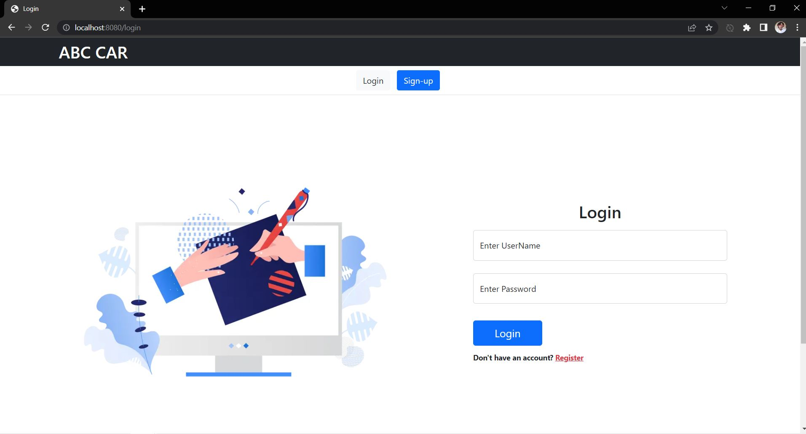
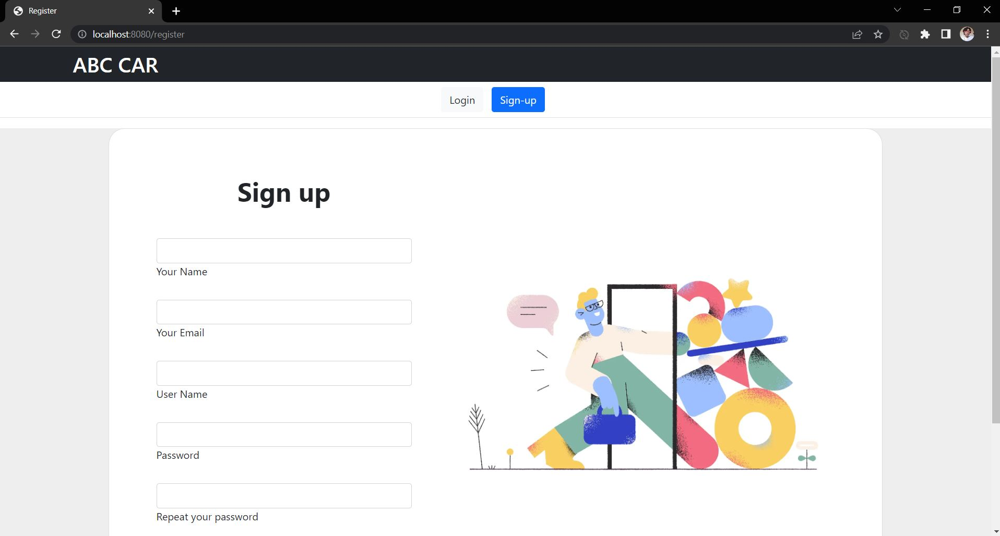
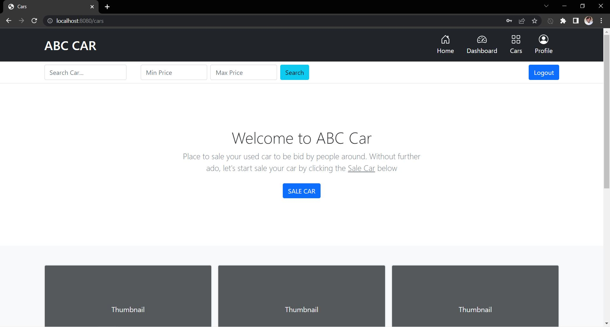
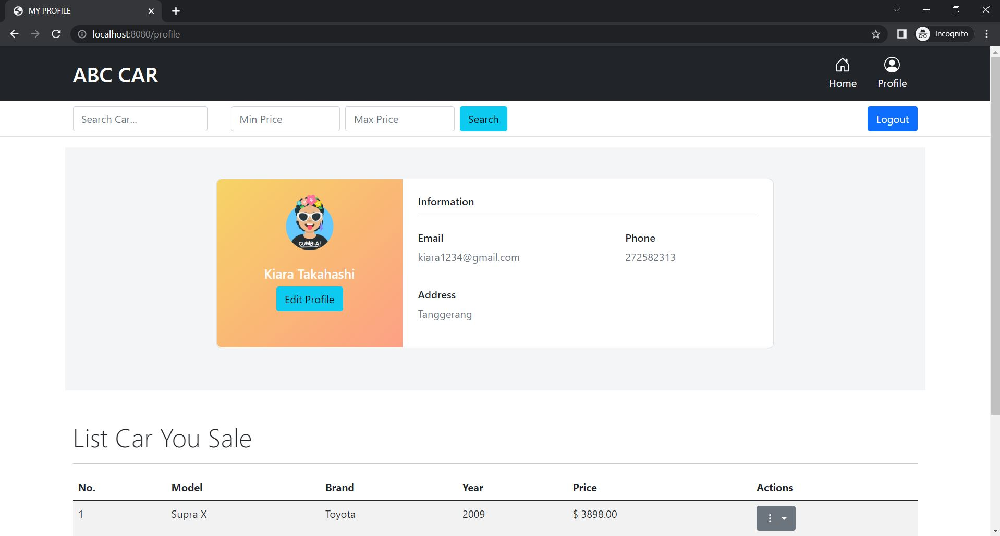
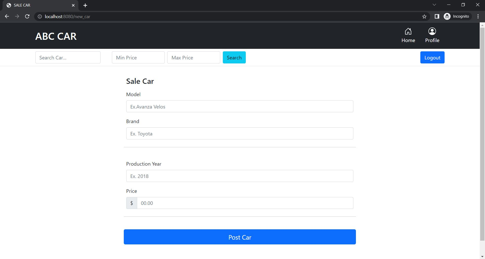
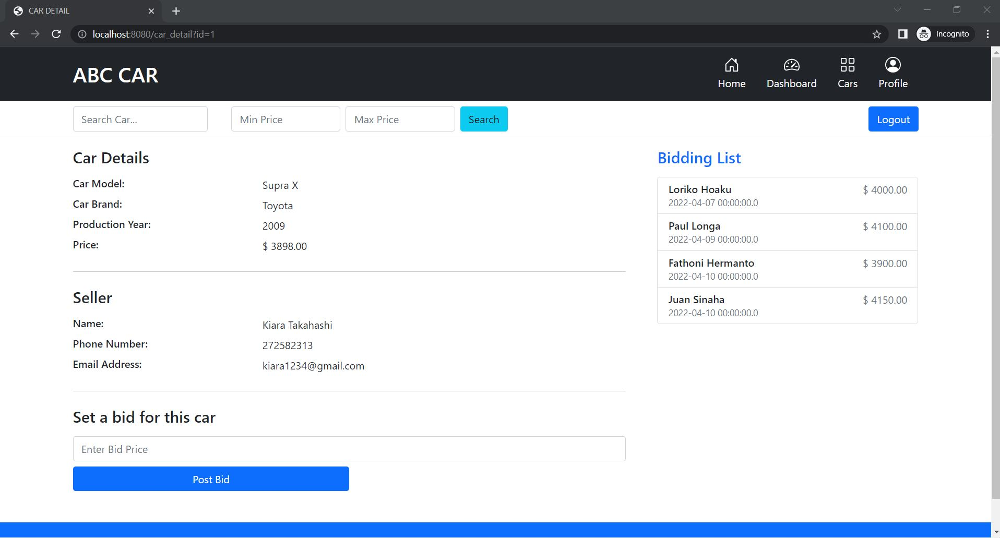
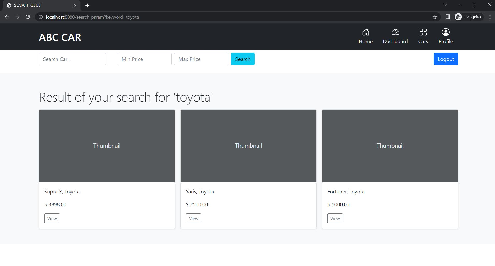
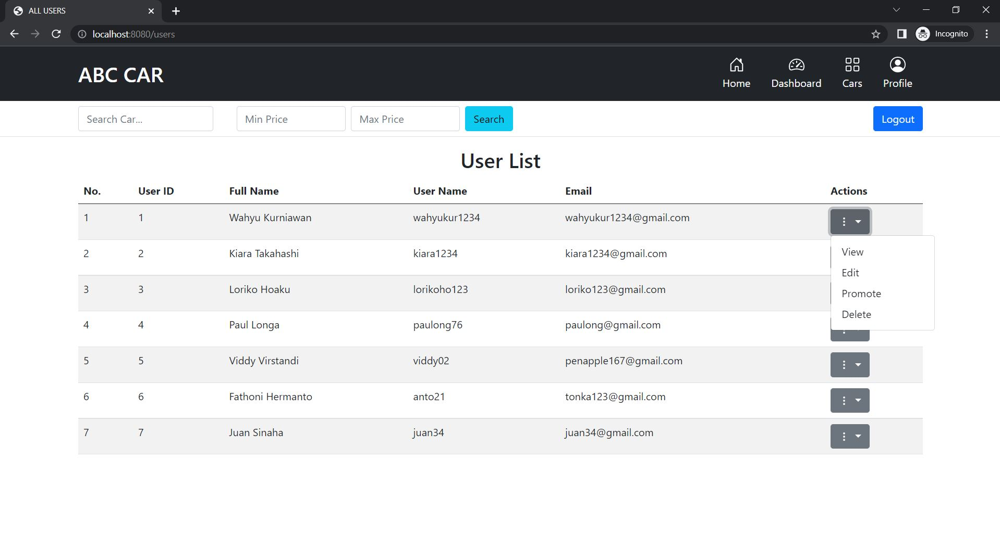
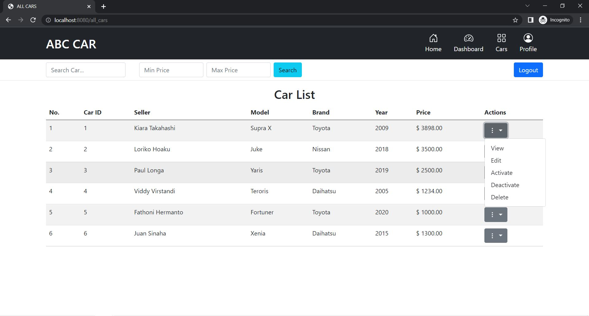

# ABC-Car-Sales
BRIEF DESCRIPTION   
Web app of ABC Car Sales with Spring Boot and MVC. A car auction portal for user who want to sale and bid car.

OVERVIEW    
There are 2 types of users
- Users (normal user)
- Administrator

Functionality that users could perform
- Register in the Portal
- Login to the Portal
- Post a Car for Sale
- Deactivate an Existing car sale
- Update their Profile after logging in.
- Post the bidding price

Functionality that admin could perform
- Register in the Portal
- Login to the portal
- View List of Registered Users
- Mark a User as Administrator
- Activate / Deactivate a Car post
- Update their profile

TECHNOLGIES USED & SYSTEM REQUIREMENTS    
Backend: Java SE 1.8, Spring Boot  
Frontend: JSP, HTML 5, CSS, Bootstrap 5   
DBMS: MySQL 8.0.27    
OS: Windows 10    
IDE: STS 4    

Note*   
Different version can be use but keep in mind to change the configuration / settings too in related place. Use the Recommend above to avoid unnecessary error.

HOW TO RUN
- Have a Java Installed in the computer
- Import maven project the 'CarPortal_SpringBoot_ADP' folder to the IDE. Do maven update!
- Create new database in MySQL with same name mention in the application.properties (Could be change to your preference)
- Run as spring boot app

PREVIEW SOME SCREENSHOT   

